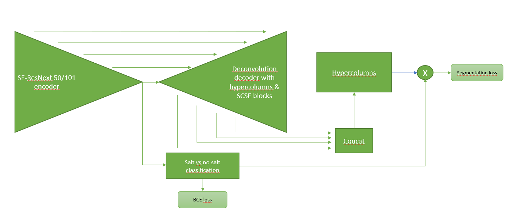
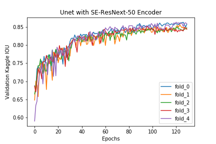
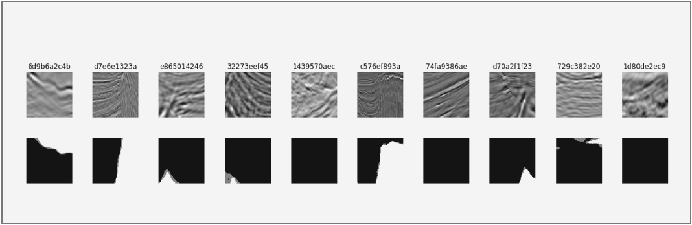

# UNet for Image Segmentation using SE-ResNext-50/101 encoders pretrained on ImageNet 
By [Terkel Bo Olsen](https://www.linkedin.com/in/olsent0/)

## Model structure
This repository presents my solution to the [TGS Salt Detection Challenge](https://www.kaggle.com/c/tgs-salt-identification-challenge) hosted on Kaggle. It is build upon the standard UNet [1] architecture but using two different encoders, namely the SE-ResNext-50 and SE-ResNext-101 pretrained on ImageNet [2] and was implemented in PyTorch. It further implements the use of hypercolums [3] and Concurrent Spatial and Channel Squeeze & Excitation (SCSE) [4] implemented in the structure of the UNet. For optimization I use a multi-loss strategy using the standard BCE loss for classification of salt/no-salt in the encoder part and using the Lovasz loss [5] as a segmentation loss. To further facilitate the correct classification of no-salt images (which was important for the competition metric) a gating mechanism was implemented as multiplication before computing the final probability map. See the simplified structure below for clarification.

## Results
The training procedure was set such that an initial round of 20 epochs was run using BCE loss for the classification loss and a combination of dice loss and BCE loss for the segmentation loss. At all times the weighting between classification and segmentation loss was 1 to 10. After an initial 20 epochs the segmentation loss was changed to the Lovasz loss. This results in the following training results on the validation set of using the SE-ResNext-50 encoder. Here the Kaggle IOU metric is the "mean average precision at different intersection over union (IoU)", for more info see [here](https://www.kaggle.com/c/tgs-salt-identification-challenge#evaluation).

By using a five fold validation strategy for each of the two models (ResNext50 + 101) and utilizing flip test time augmentation (TTA) [6] for each of the model predictions and subsequently mean ensembling the two (70/30 % weigthing favoring ResNext101) the following results are obtained on the Public and Private leaderboard.

| Model                  | Public LB | Private LB |
|------------------------|-----------|------------|
| SE-ResNext-50 Encoder  | 0.851     | 0.871      |
| SE-ResNext-101 Encoder | 0.855     | 0.874      |
| Mean ensemble          | 0.855     | 0.875      |

This gives a placement in the top 4 % on the Private Leaderboard placed 127th of 3291 participants.
Utilizing the first fold of both models and ensembling the results on 10 randomly chosen examples from the validation set, the following results are obtained:

Here the top row are the input images and bottom row are the corresponding mask and prediction. Here the light gray are the model predictions whereas the white is the actual mask. As is seen the model performs relatively well on most examples and is specifically good at predicting whether or not salt is in the image.

## Conclusions
This competition was slightly different than usual segmentation competitions. Here approximately 40 % of the training set (and supposedly the same in the test set) had input images with only background (i.e. no salt). As the Kaggle metric in the competition very heavly penalizes the prediction of salt in a non-salt image I focused on building a model specifically designed for correct prediction of no-salt images while still keeping the segmentation capabilities high. This was obtained by specifically designing an optimization strategy using a multi-loss scheme weighting the gradients from the classification loss and segmentation loss appropriately. 
